# HoneyHive Customer Deployment Guide

## Overview

HoneyHive deploys as a complete observability platform in your AWS account, providing enterprise-grade monitoring, logging, and analytics capabilities with secure multi-tenant isolation.

## What Gets Deployed in Your Account

### 🏗️ **Core Infrastructure**

#### **VPC Network (10.x.0.0/16)**
- **Public Subnets** - Internet gateway access for load balancers
- **Private Subnets** - All HoneyHive workloads run here
- **NAT Gateway** - Controlled outbound internet access
- **VPC Endpoints** - Private connectivity to AWS services (S3, ECR, etc.)

#### **DNS Infrastructure**
- **Private Route53 Zone** - Internal service discovery
- **Domain Configuration** - Your chosen domain for HoneyHive UI
- **SSL/TLS Certificates** - Automatic certificate management

#### **VPN Access**
- **Twingate Connector** - Secure VPN for remote access
- **User Authentication** - Integration with your identity provider
- **Network Policies** - Granular access controls

### 🚀 **Kubernetes Platform**

#### **EKS Cluster**
- **Control Plane** - Managed by AWS
- **Worker Nodes** - Auto-scaling based on demand
- **Node Groups** - Optimized for different workload types
- **Security Groups** - Network-level access controls

#### **Auto-scaling**
- **Karpenter** - Intelligent node provisioning
- **Horizontal Pod Autoscaling** - Application-level scaling
- **Resource Quotas** - Per-tenant resource limits

#### **Core Services**
- **ArgoCD** - GitOps deployment automation
- **External Secrets Operator** - Secure credential management
- **Ingress Controller** - Load balancing and SSL termination

### 📊 **Observability Stack**

#### **Monitoring**
- **Prometheus** - Metrics collection and storage
- **Grafana** - Dashboards and visualization
- **AlertManager** - Alert routing and notification
- **Custom Dashboards** - HoneyHive-specific monitoring

#### **Logging**
- **Fluent Bit** - Log collection and forwarding
- **Centralized Logging** - Aggregated log storage
- **Log Retention** - Configurable retention policies
- **Search & Analytics** - Log querying capabilities

#### **Tracing**
- **OpenTelemetry** - Distributed tracing
- **Jaeger** - Trace visualization
- **Performance Monitoring** - Application performance insights

### 🗄️ **Data Storage**

#### **S3 Buckets**
- **Metrics Storage** - Prometheus time-series data
- **Log Storage** - Centralized log aggregation
- **Configuration** - Application and infrastructure configs
- **Backups** - Automated backup storage

#### **Database Services**
- **RDS PostgreSQL** - Application metadata
- **DocumentDB** - Document-based data storage
- **Redis** - Caching and session storage

## Customer Requirements

### 🔧 **AWS Account Setup**

#### **Account Requirements**
- **AWS Account** - Dedicated account recommended
- **Administrator Access** - Initial setup permissions
- **Billing** - AWS costs will be charged to your account
- **Region** - Choose primary AWS region (US West 2, US East 1, EU West 1)

#### **IAM Permissions**
- **Cross-Account Access** - HoneyHive orchestration account access
- **Service Roles** - EKS, RDS, and other AWS services
- **Pod Identity** - Kubernetes service account roles

### 🌐 **Network Requirements**

#### **Internet Connectivity**
- **Outbound HTTPS** - For AWS API calls and updates
- **DNS Resolution** - Public DNS for external services
- **NTP** - Time synchronization for certificates

#### **Security Groups**
- **Ingress Rules** - HTTPS (443) from your networks
- **Egress Rules** - HTTPS (443) to AWS services
- **Internal Communication** - Kubernetes pod-to-pod traffic

### 🔐 **Security & Compliance**

#### **Encryption**
- **KMS Keys** - Customer-managed encryption keys
- **Data at Rest** - All data encrypted with your keys
- **Data in Transit** - TLS 1.3 for all communications
- **Secret Management** - AWS Secrets Manager integration

#### **Access Control**
- **RBAC** - Role-based access control
- **Multi-Factor Authentication** - Required for all users
- **Audit Logging** - Complete audit trail
- **Network Segmentation** - Isolated tenant networks

### 📋 **Operational Requirements**

#### **Monitoring**
- **CloudWatch** - AWS service monitoring
- **Custom Metrics** - Application-specific metrics
- **Log Aggregation** - Centralized logging
- **Alerting** - Proactive issue detection

#### **Backup & Recovery**
- **Automated Backups** - Daily backups of all data
- **Point-in-Time Recovery** - Database recovery capabilities
- **Disaster Recovery** - Cross-region backup options
- **Testing** - Regular recovery testing

## System Architecture

```mermaid
graph TB
    subgraph "Your AWS Account"
        subgraph "VPC 10.x.0.0/16"
            subgraph "Public Subnets"
                ALB[⚖️ Application Load Balancer]
                NAT[🌐 NAT Gateway]
                VPN[🔐 Twingate Connector]
            end
            
            subgraph "Private Subnets"
                subgraph "EKS Cluster"
                    EKS[☸️ EKS Control Plane]
                    WORKERS[🖥️ Worker Nodes]
                    KARP[📈 Karpenter]
                end
                
                subgraph "HoneyHive Services"
                    API[🔌 HoneyHive API]
                    UI[🖥️ HoneyHive UI]
                    WORKER[⚙️ Background Workers]
                end
                
                subgraph "Observability"
                    PROM[📊 Prometheus]
                    GRAFANA[📈 Grafana]
                    FLUENT[📝 Fluent Bit]
                end
                
                subgraph "Data Layer"
                    RDS[🗄️ RDS PostgreSQL]
                    S3[📦 S3 Buckets]
                    REDIS[🔴 Redis Cache]
                end
            end
        end
    end
    
    subgraph "External"
        USERS[👥 Your Users]
        GITHUB[🐙 GitHub Actions]
        TWINGATE[🔐 Twingate VPN]
    end
    
    %% User access
    USERS --> ALB
    TWINGATE --> VPN
    
    %% Internal connections
    ALB --> API
    ALB --> UI
    API --> RDS
    API --> S3
    API --> REDIS
    WORKER --> RDS
    WORKER --> S3
    
    %% Observability
    PROM --> S3
    GRAFANA --> PROM
    FLUENT --> S3
    
    %% Auto-scaling
    KARP --> WORKERS
    WORKERS --> API
    WORKERS --> UI
    WORKERS --> WORKER
```

## Resource Sizing

### 📊 **Default Configuration**

#### **EKS Cluster**
- **Control Plane** - Managed by AWS
- **Worker Nodes** - 3 nodes minimum, auto-scaling to 50+
- **Instance Types** - t3.large (2 vCPU, 8GB RAM)
- **Storage** - 100GB per node (gp3)

#### **Database**
- **RDS PostgreSQL** - db.t3.medium (2 vCPU, 4GB RAM)
- **Storage** - 100GB (auto-scaling to 1TB)
- **Backup** - 7-day retention
- **Multi-AZ** - High availability option

#### **S3 Storage**
- **Metrics** - 1TB initial capacity
- **Logs** - 500GB initial capacity
- **Backups** - 200GB initial capacity
- **Retention** - 30 days (configurable)

### 🚀 **Scaling Options**

#### **Small Deployment**
- **Nodes** - 3-10 nodes
- **Users** - Up to 100 concurrent users
- **Data** - Up to 1TB per month
- **Cost** - ~$500-1000/month

#### **Medium Deployment**
- **Nodes** - 10-50 nodes
- **Users** - Up to 500 concurrent users
- **Data** - Up to 10TB per month
- **Cost** - ~$1000-3000/month

#### **Large Deployment**
- **Nodes** - 50+ nodes
- **Users** - 500+ concurrent users
- **Data** - 10TB+ per month
- **Cost** - $3000+/month

## Security Model

### 🔐 **Data Protection**

#### **Encryption**
- **At Rest** - AES-256 encryption for all data
- **In Transit** - TLS 1.3 for all communications
- **Keys** - Customer-managed KMS keys
- **Rotation** - Automatic key rotation

#### **Access Control**
- **Authentication** - Multi-factor authentication required
- **Authorization** - Role-based access control
- **Network** - Private subnets only
- **API** - Rate limiting and authentication

### 🛡️ **Network Security**

#### **Network Isolation**
- **Private Subnets** - All workloads in private networks
- **Security Groups** - Micro-segmentation
- **NACLs** - Network-level access controls
- **VPC Endpoints** - Private AWS service access

#### **VPN Access**
- **Twingate** - Secure remote access
- **User Management** - Integration with your identity provider
- **Audit Logging** - Complete access audit trail
- **Session Management** - Configurable session timeouts

## Operational Model

### 🔄 **Deployment Process**

#### **Initial Setup**
1. **Account Preparation** - AWS account and permissions
2. **Network Configuration** - VPC and security groups
3. **HoneyHive Deployment** - Automated infrastructure deployment
4. **Service Configuration** - Application and monitoring setup
5. **User Access** - VPN and authentication configuration

#### **Ongoing Operations**
- **Monitoring** - 24/7 system monitoring
- **Updates** - Automated security and feature updates
- **Backups** - Daily automated backups
- **Scaling** - Automatic scaling based on demand

### 📊 **Monitoring & Alerting**

#### **System Monitoring**
- **Infrastructure** - AWS resource monitoring
- **Applications** - HoneyHive service monitoring
- **Performance** - Response time and throughput
- **Capacity** - Resource utilization and scaling

#### **Alerting**
- **Critical Issues** - Immediate notification
- **Performance** - Threshold-based alerts
- **Capacity** - Resource limit alerts
- **Security** - Security event alerts

## Support & Maintenance

### 🛠️ **HoneyHive Support**

#### **Managed Services**
- **Infrastructure** - AWS resource management
- **Applications** - HoneyHive service management
- **Monitoring** - 24/7 system monitoring
- **Updates** - Security and feature updates

#### **Customer Responsibilities**
- **User Management** - User access and permissions
- **Data Governance** - Data retention and compliance
- **Network Access** - VPN and firewall configuration
- **Backup Testing** - Recovery procedure validation

### 📞 **Support Channels**

#### **Technical Support**
- **Documentation** - Comprehensive technical guides
- **Knowledge Base** - Common issues and solutions
- **Support Tickets** - Priority-based support
- **Emergency Support** - 24/7 critical issue support

#### **Training & Onboarding**
- **User Training** - Platform usage training
- **Administrator Training** - Management and configuration
- **Best Practices** - Security and operational guidance
- **Documentation** - Complete system documentation

---

*This deployment provides a complete, enterprise-grade observability platform in your AWS account with full control over your data and infrastructure.*
