# HoneyHive Infrastructure Diagrams

## Complete Infrastructure Architecture

```mermaid
graph TB
    subgraph "External"
        USERS[👥 Users]
        GITHUB[🐙 GitHub Actions]
        TWINGATE[🔐 Twingate VPN]
    end
    
    subgraph "AWS Orchestration Account"
        SECRETS[🔑 Secrets Manager]
        KMS[🔐 KMS Keys]
        STATE[📦 S3 State Bucket]
        IAM[👤 IAM Roles]
    end
    
    subgraph "AWS Target Account"
        subgraph "VPC 10.x.0.0/16"
            subgraph "Public Subnets"
                NAT[🌐 NAT Gateway]
                ALB[⚖️ Application Load Balancer]
                VPN[🔐 Twingate Connector]
            end
            
            subgraph "Private Subnets"
                subgraph "EKS Cluster"
                    EKS[☸️ EKS Control Plane]
                    WORKERS[🖥️ Worker Nodes]
                    KARP[📈 Karpenter]
                end
                
                subgraph "Core Services"
                    ARGOCD[🔄 ArgoCD]
                    ESO[🔐 External Secrets]
                    MONITOR[📊 Prometheus/Grafana]
                end
                
                subgraph "Data Layer"
                    RDS[🗄️ RDS Database]
                    S3[📦 S3 Buckets]
                    DOCDB[📄 DocumentDB]
                end
            end
        end
    end
    
    %% External connections
    USERS --> ALB
    GITHUB --> SECRETS
    TWINGATE --> VPN
    
    %% Orchestration connections
    SECRETS --> KMS
    GITHUB --> IAM
    IAM --> EKS
    
    %% Internal connections
    ALB --> EKS
    NAT --> WORKERS
    VPN --> WORKERS
    EKS --> KARP
    EKS --> ARGOCD
    EKS --> ESO
    EKS --> MONITOR
    EKS --> RDS
    EKS --> S3
    EKS --> DOCDB
    
    %% Security connections
    ESO --> SECRETS
    ESO --> KMS
    WORKERS --> S3
    WORKERS --> RDS
```

## Security Architecture

```mermaid
graph TB
    subgraph "Authentication Flow"
        DEV[👨‍💻 Developer]
        GITHUB[🐙 GitHub]
        OIDC[🔐 AWS OIDC]
        FED[👤 Federated Role]
        PROV[👤 Provisioner Role]
        TARGET[🎯 Target Account]
    end
    
    subgraph "Network Security"
        IGW[🌐 Internet Gateway]
        NAT[🌐 NAT Gateway]
        ALB[⚖️ Load Balancer]
        EKS[☸️ EKS Cluster]
        RDS[🗄️ Database]
    end
    
    subgraph "Data Security"
        KMS[🔐 KMS Encryption]
        SECRETS[🔑 Secrets Manager]
        S3[📦 Encrypted Storage]
        BACKUP[💾 Encrypted Backups]
    end
    
    DEV --> GITHUB
    GITHUB --> OIDC
    OIDC --> FED
    FED --> PROV
    PROV --> TARGET
    
    IGW --> ALB
    ALB --> EKS
    NAT --> EKS
    EKS --> RDS
    
    KMS --> SECRETS
    KMS --> S3
    KMS --> BACKUP
    SECRETS --> EKS
```

## Deployment Types

```mermaid
graph TB
    subgraph "Deployment Options"
        FULL[🏢 Full Stack<br/>Complete Platform]
        CONTROL[🎛️ Control Plane<br/>API + Dashboard]
        DATA[📊 Data Plane<br/>Compute Workloads]
        FEDERATED[🌐 Federated BYOC<br/>Customer Cloud]
        HYBRID[🔀 Hybrid SaaS<br/>Mixed Deployment]
    end
    
    subgraph "Components"
        SUB[🏗️ Substrate<br/>VPC + DNS + VPN]
        HOST[🚀 Hosting<br/>EKS + Karpenter]
        APP[📱 Application<br/>Services + Data]
    end
    
    FULL --> SUB
    FULL --> HOST
    FULL --> APP
    
    CONTROL --> SUB
    CONTROL --> HOST
    CONTROL --> APP
    
    DATA --> SUB
    DATA --> HOST
    
    FEDERATED --> SUB
    FEDERATED --> HOST
    
    HYBRID --> SUB
    HYBRID --> HOST
```

## Multi-Environment Strategy

```mermaid
graph TB
    subgraph "Environments"
        TEST[🧪 Test<br/>Development]
        STAGE[🎭 Stage<br/>Pre-production]
        PROD[🏭 Production<br/>Live Systems]
    end
    
    subgraph "Regions"
        USW2[🌎 US West 2<br/>Primary]
        USE1[🌎 US East 1<br/>DR]
        EUW1[🌍 EU West 1<br/>Global]
    end
    
    subgraph "Accounts"
        ORCH[🎼 Orchestration<br/>Secrets + State]
        TARGET[🎯 Target<br/>Workloads]
    end
    
    TEST --> USW2
    STAGE --> USW2
    PROD --> USW2
    PROD --> USE1
    PROD --> EUW1
    
    USW2 --> ORCH
    USE1 --> ORCH
    EUW1 --> ORCH
    
    ORCH --> TARGET
```

## Data Flow Architecture

```mermaid
graph TB
    subgraph "Data Sources"
        APPS[📱 Applications]
        INFRA[🏗️ Infrastructure]
        LOGS[📝 Logs]
    end
    
    subgraph "Collection Layer"
        PROM[📊 Prometheus]
        FLUENT[📤 Fluent Bit]
        OTEL[🔍 OpenTelemetry]
    end
    
    subgraph "Storage Layer"
        METRICS[📈 Metrics DB]
        LOGS_STORE[📝 Log Storage]
        TRACES[🔍 Trace Storage]
    end
    
    subgraph "Visualization"
        GRAFANA[📊 Grafana]
        DASHBOARDS[📈 Dashboards]
        ALERTS[🚨 Alerting]
    end
    
    APPS --> PROM
    INFRA --> PROM
    LOGS --> FLUENT
    APPS --> OTEL
    
    PROM --> METRICS
    FLUENT --> LOGS_STORE
    OTEL --> TRACES
    
    METRICS --> GRAFANA
    LOGS_STORE --> GRAFANA
    TRACES --> GRAFANA
    
    GRAFANA --> DASHBOARDS
    GRAFANA --> ALERTS
```

## High Availability Design

```mermaid
graph TB
    subgraph "Multi-AZ Deployment"
        AZ1[🏢 Availability Zone 1]
        AZ2[🏢 Availability Zone 2]
        AZ3[🏢 Availability Zone 3]
    end
    
    subgraph "AZ1 Components"
        EKS1[☸️ EKS Node 1]
        RDS1[🗄️ RDS Primary]
        S31[📦 S3 Bucket]
    end
    
    subgraph "AZ2 Components"
        EKS2[☸️ EKS Node 2]
        RDS2[🗄️ RDS Replica]
        S32[📦 S3 Bucket]
    end
    
    subgraph "AZ3 Components"
        EKS3[☸️ EKS Node 3]
        RDS3[🗄️ RDS Replica]
        S33[📦 S3 Bucket]
    end
    
    subgraph "Load Balancing"
        ALB[⚖️ Application Load Balancer]
        NLB[⚖️ Network Load Balancer]
    end
    
    ALB --> EKS1
    ALB --> EKS2
    ALB --> EKS3
    
    NLB --> RDS1
    NLB --> RDS2
    NLB --> RDS3
    
    EKS1 --> S31
    EKS2 --> S32
    EKS3 --> S33
```

---

*These diagrams show the complete HoneyHive infrastructure architecture, security model, deployment options, and operational patterns.*
