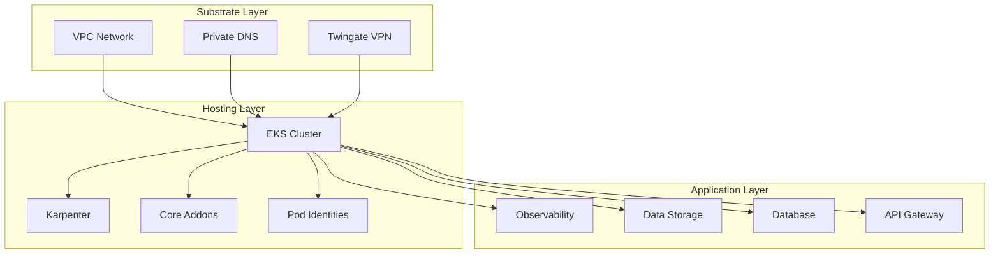
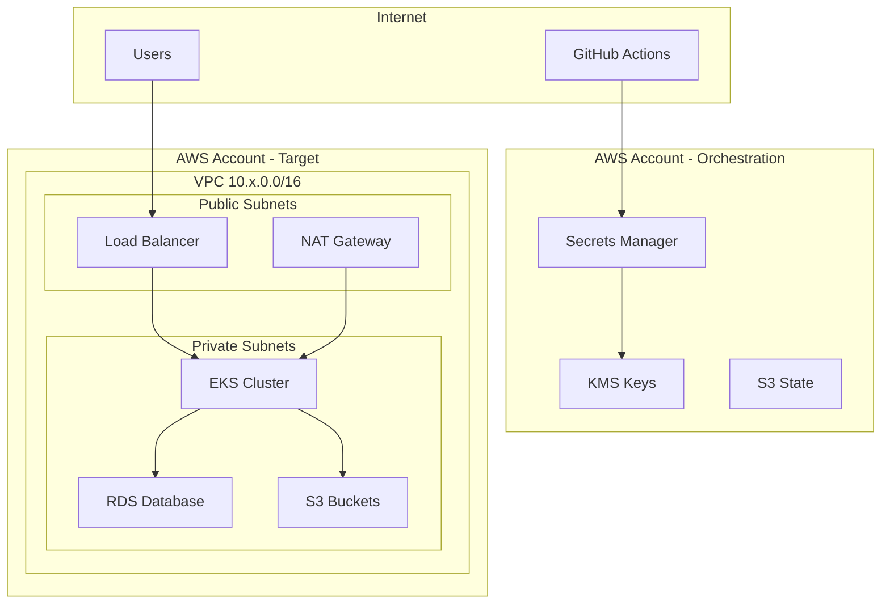

# HoneyHive Infrastructure Overview

## Architecture Overview

HoneyHive's infrastructure is built on a modern **Terragrunt Stacks** architecture deployed on AWS, providing enterprise-grade observability and monitoring capabilities with secure multi-tenant isolation.

## Core Components

### 🏗️ **Substrate Layer** (Foundation)
- **VPC Network** - Private networking with public/private subnets across multiple AZs
- **DNS Infrastructure** - Private Route53 zones for internal service discovery
- **VPN Access** - Twingate VPN for secure remote access to private resources
- **Security Groups** - Network-level security controls and traffic filtering

### 🚀 **Hosting Layer** (Platform)
- **EKS Cluster** - Managed Kubernetes cluster with latest version support
- **Karpenter** - Intelligent node autoscaling based on workload demands
- **Core Addons** - Essential Kubernetes services (ArgoCD, External Secrets, monitoring)
- **Pod Identities** - IAM roles for service accounts (IRSA) for secure AWS access

### 📊 **Application Layer** (Workloads)
- **Observability Stack** - Prometheus, Grafana, and custom monitoring
- **Data Storage** - S3 buckets for metrics, logs, and configuration data
- **Database Services** - RDS/DocumentDB for application data persistence
- **API Gateway** - Secure endpoints for external integrations

## Security Features

### 🔐 **Authentication & Authorization**
- **GitHub OIDC** - Secure CI/CD authentication without long-lived credentials
- **AWS IAM Roles** - Fine-grained permissions with least-privilege access
- **Pod Identity** - Kubernetes-native AWS authentication for workloads
- **Multi-Account Architecture** - Orchestration and target account separation

### 🛡️ **Network Security**
- **Private Subnets** - All workloads run in private network segments
- **NAT Gateway** - Controlled outbound internet access
- **VPC Endpoints** - Private connectivity to AWS services (S3, ECR, etc.)
- **Security Groups** - Micro-segmentation with application-specific rules

### 🔒 **Data Protection**
- **KMS Encryption** - Customer-managed keys for all data at rest
- **Secrets Management** - AWS Secrets Manager with cross-account access
- **Encryption in Transit** - TLS 1.3 for all service communications
- **Backup & Recovery** - Automated backups with point-in-time recovery

## Deployment Architecture

### 📋 **Deployment Types**
- **Full Stack** - Complete platform with all features enabled
- **Control Plane** - API, dashboard, and GitOps management only
- **Data Plane** - Compute workloads and data processing
- **Federated BYOC** - Customer's cloud, HoneyHive managed
- **Hybrid SaaS** - Control in HoneyHive, data in customer environment

### 🌍 **Multi-Environment Support**
- **Test** - Development and testing environments
- **Stage** - Pre-production validation
- **Production** - Live customer workloads
- **Regional Isolation** - Independent deployments per AWS region

## Infrastructure Dependencies

## Network Topology

## Key Integrations

### 🔗 **External Services**
- **GitHub** - Source code management and CI/CD pipelines
- **AWS Services** - S3, RDS, EKS, Secrets Manager, KMS
- **Twingate** - Secure VPN access for remote teams
- **Monitoring** - Prometheus, Grafana, CloudWatch integration

### 📡 **Data Sources**
- **Application Metrics** - Custom application telemetry
- **Infrastructure Metrics** - System and cluster monitoring
- **Log Aggregation** - Centralized logging with Fluent Bit
- **Tracing** - Distributed tracing with OpenTelemetry

## Operational Features

### 🚀 **Scalability**
- **Auto-scaling** - Karpenter-based node scaling based on demand
- **Horizontal Pod Autoscaling** - Application-level scaling
- **Multi-AZ Deployment** - High availability across availability zones
- **Regional Distribution** - Deploy across multiple AWS regions

### 🔄 **GitOps Workflow**
- **ArgoCD** - Declarative application deployment
- **Infrastructure as Code** - Terraform/Terragrunt for all resources
- **Automated Deployments** - GitHub Actions-driven CI/CD
- **Environment Promotion** - Test → Stage → Production pipeline

### 📊 **Monitoring & Observability**
- **Prometheus** - Metrics collection and alerting
- **Grafana** - Visualization and dashboards
- **Fluent Bit** - Log collection and forwarding
- **OpenTelemetry** - Distributed tracing and metrics

## Enterprise Features

### 🏢 **Multi-Tenancy**
- **Namespace Isolation** - Kubernetes namespace-based tenant separation
- **Resource Quotas** - Per-tenant resource limits and controls
- **Network Policies** - Tenant-specific network segmentation
- **RBAC** - Role-based access control for tenant resources

### 🔐 **Compliance & Governance**
- **Audit Logging** - Comprehensive audit trails for all operations
- **Policy Enforcement** - Automated compliance checking
- **Secret Rotation** - Automated credential rotation
- **Backup & Recovery** - Point-in-time recovery capabilities

### 🌐 **Global Deployment**
- **Multi-Region** - Deploy across multiple AWS regions
- **Edge Computing** - Support for edge deployment scenarios
- **Disaster Recovery** - Cross-region disaster recovery capabilities
- **Data Residency** - Deploy in specific regions for compliance

## Getting Started

### 📋 **Prerequisites**
- AWS Account with appropriate permissions
- GitHub repository with HoneyHive workflows
- Twingate account for VPN access
- Domain name for DNS configuration

### 🚀 **Deployment Process**
1. **Configure Environment** - Set up AWS accounts and GitHub integration
2. **Deploy Substrate** - VPC, DNS, and VPN infrastructure
3. **Deploy Hosting** - EKS cluster and core platform services
4. **Deploy Applications** - Observability and data services
5. **Configure Access** - Set up user access and monitoring

### 📞 **Support & Documentation**
- **Architecture Guides** - Detailed technical documentation
- **Deployment Types** - Configuration options for different use cases
- **Troubleshooting** - Common issues and solutions
- **Best Practices** - Security and operational recommendations

---

*For detailed technical documentation, see the [Stack Architecture Guide](STACK_ARCHITECTURE.md) and [Deployment Types](DEPLOYMENT_TYPES.md).*
