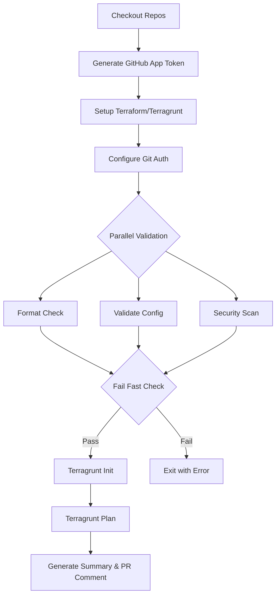
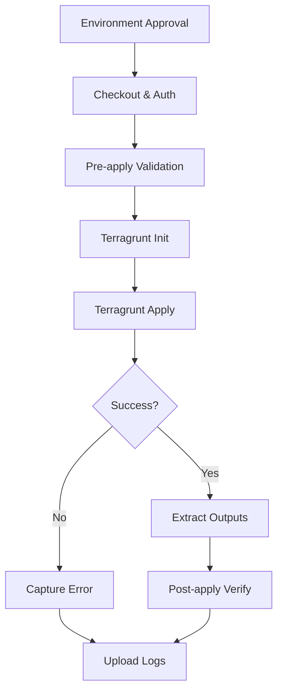
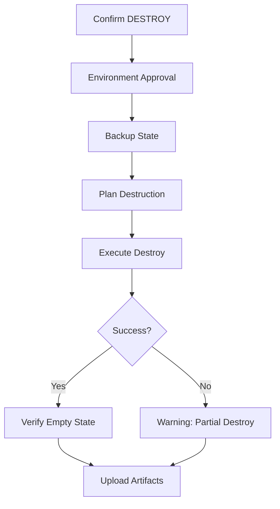
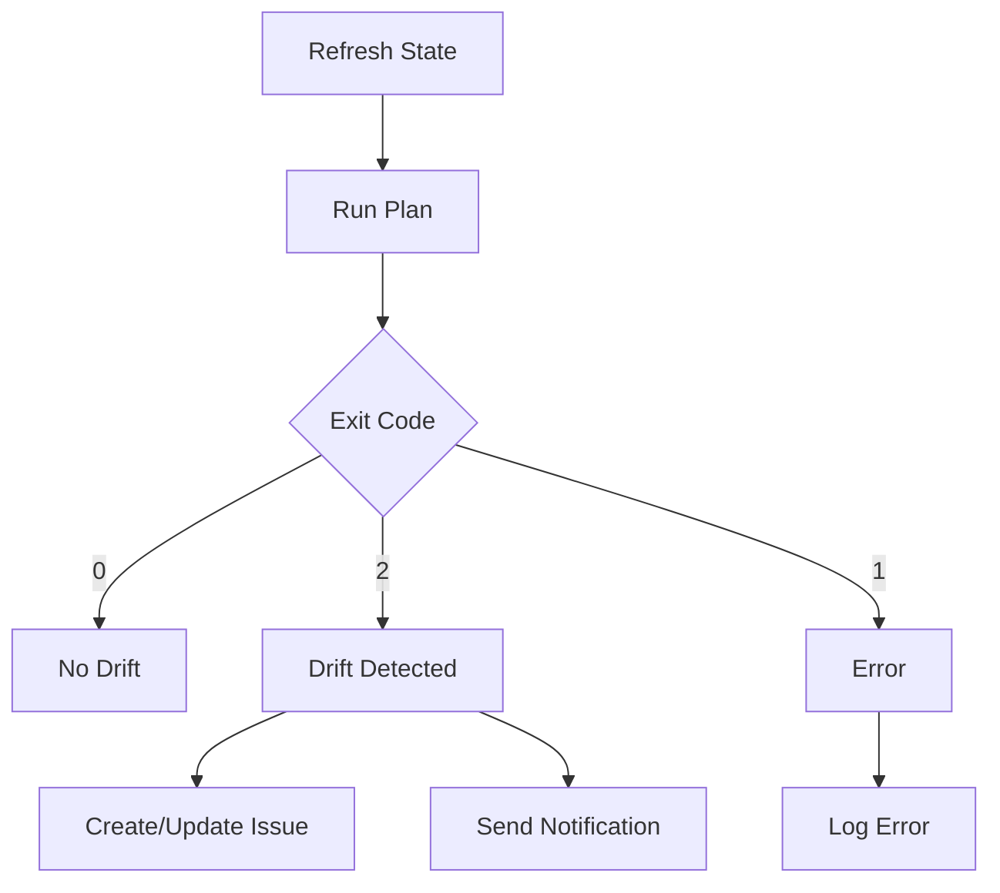

# Workflow Documentation

## Overview

This document provides detailed documentation for all reusable workflows in the Honeyhive Workflows catalog.

## Table of Contents

1. [Authentication Setup](#authentication-setup)
2. [Plan Workflow](#plan-workflow-rwf-tg-planyml)
3. [Apply Workflow](#apply-workflow-rwf-tg-applyyml)
4. [Destroy Workflow](#destroy-workflow-rwf-tg-destroyyml)
5. [Drift Detection Workflow](#drift-detection-workflow-rwf-tg-driftyml)
6. [Caller Workflow Patterns](#caller-workflow-patterns)
7. [Environment Protection](#environment-protection)
8. [Troubleshooting](#troubleshooting)

## Authentication Setup

### GitHub App Configuration

All workflows require GitHub App authentication to access private Terraform modules. Tokens are automatically generated using [actions/create-github-app-token@v2](https://github.com/actions/create-github-app-token).

#### Required Secrets

```yaml
secrets:
  GH_APP_ID: ${{ secrets.GH_APP_ID }}
  GH_APP_PRIVATE_KEY: ${{ secrets.GH_APP_PRIVATE_KEY }}
```

### AWS OIDC Configuration

For AWS resource provisioning, configure OIDC authentication:

```yaml
secrets:
  AWS_OIDC_ROLE: arn:aws:iam::123456789012:role/HoneyhiveProvisioner
```

## Plan Workflow (`rwf-tg-plan.yml`)

### Purpose

Generates and validates Terragrunt plans with comprehensive checks using [gruntwork-io/terragrunt-action](https://github.com/gruntwork-io/terragrunt-action) for execution.

### Inputs

| Input | Type | Required | Default | Description |
|-------|------|----------|---------|-------------|
| `stack_path` | string | ✅ | - | Path to stack in caller repo |
| `overlay_ref` | string | ❌ | `main` | Version of catalog to use |
| `tg_args` | string | ❌ | `""` | Additional Terragrunt arguments |

### Execution Flow



### Validation Steps

1. **Format Check** (`terragrunt hclfmt --check`)
   - Ensures consistent formatting
   - Non-blocking warning if issues found

2. **Validation** (`terragrunt validate`)
   - Verifies configuration syntax
   - **Blocking error** if invalid - workflow fails here

3. **Security Scan** (`checkov`)
   - Scans for security issues  
   - Non-blocking warning for findings

### Outputs

- **Job Summary**: Compact plan summary in GitHub UI
- **Artifact**: Full plan output and logs
- **PR Comment**: Status table (if PR triggered)

### Example Usage

```yaml
- name: Plan infrastructure
  uses: honeyhiveai/honeyhive-workflows/.github/workflows/rwf-tg-plan.yml@v1
  with:
    stack_path: apiary/acme/usw2
    overlay_ref: v1.2.3
  secrets:
    GH_APP_ID: ${{ secrets.GH_APP_ID }}
    GH_APP_PRIVATE_KEY: ${{ secrets.GH_APP_PRIVATE_KEY }}
    AWS_OIDC_ROLE: ${{ secrets.AWS_OIDC_ROLE }}
```

## Apply Workflow (`rwf-tg-apply.yml`)

### Purpose

Applies Terragrunt changes with safety checks and audit trail using [gruntwork-io/terragrunt-action](https://github.com/gruntwork-io/terragrunt-action) with auto-approve enabled.

### Inputs

Same as Plan workflow.

### Key Features

- **Environment Protection**: Requires manual approval
- **Pre-apply Validation**: Ensures configuration is valid
- **Apply Logging**: Captures full output
- **Post-apply Verification**: Confirms state exists
- **Audit Trail**: 30-day log retention

### Execution Flow



### Safety Features

1. **Concurrency Control**: Prevents parallel applies to same stack
2. **Auto-approve**: Skips interactive prompts
3. **State Verification**: Confirms resources tracked
4. **PR Updates**: Comments with results

### Example Usage

```yaml
- name: Apply infrastructure
  uses: honeyhiveai/honeyhive-workflows/.github/workflows/rwf-tg-apply.yml@v1
  with:
    stack_path: apiary/acme/usw2
  secrets: inherit
  environment: production  # Requires approval
```

## Destroy Workflow (`rwf-tg-destroy.yml`)

### Purpose

Safely destroys infrastructure with multiple confirmation steps.

### Additional Inputs

| Input | Type | Required | Description |
|-------|------|----------|-------------|
| `confirm_destroy` | string | ✅ | Must be "DESTROY" to proceed |

### Safety Features

1. **Double Confirmation**:
   - Input parameter must be "DESTROY"
   - Environment approval required

2. **State Backup**:
   - Backs up current state before destruction
   - Lists resources to be destroyed

3. **Plan Before Destroy**:
   - Shows destruction plan
   - Confirms what will be removed

4. **Extended Retention**:
   - 90-day artifact retention for destroy logs

### Execution Flow



### Example Usage

```yaml
- name: Destroy infrastructure
  uses: honeyhiveai/honeyhive-workflows/.github/workflows/rwf-tg-destroy.yml@v1
  with:
    stack_path: apiary/acme/usw2
    confirm_destroy: DESTROY
  secrets: inherit
  environment: production
```

## Drift Detection Workflow (`rwf-tg-drift.yml`)

### Purpose

Detects infrastructure drift from desired state.

### Additional Inputs

| Input | Type | Required | Description |
|-------|------|----------|-------------|
| `notification_webhook` | string | ❌ | Webhook for notifications |

### Features

1. **Drift Detection**:
   - Refreshes state
   - Runs plan with `-detailed-exitcode`
   - Interprets exit codes

2. **Issue Management**:
   - Creates GitHub issues for drift
   - Updates existing drift issues
   - Auto-labels with `drift-detection`

3. **Notifications**:
   - Optional webhook notifications
   - Supports Slack/Teams/custom webhooks
   - Includes drift summary

### Exit Code Interpretation

- `0`: No drift detected
- `1`: Error during detection
- `2`: Drift found

### Execution Flow



### Example Usage

```yaml
- name: Check for drift
  uses: honeyhiveai/honeyhive-workflows/.github/workflows/rwf-tg-drift.yml@v1
  with:
    stack_path: apiary/acme/usw2
    notification_webhook: ${{ secrets.SLACK_WEBHOOK }}
  secrets:
    GH_APP_ID: ${{ secrets.GH_APP_ID }}
    GH_APP_PRIVATE_KEY: ${{ secrets.GH_APP_PRIVATE_KEY }}
    AWS_OIDC_ROLE: ${{ secrets.AWS_OIDC_ROLE }}
    NOTIFICATION_WEBHOOK_SECRET: ${{ secrets.WEBHOOK_SECRET }}
```

## Caller Workflow Patterns

### Change Detection Pattern

Detect changed stacks in apiary:

```yaml
- name: Detect changed stacks
  id: detect
  run: |
    CHANGED_FILES=$(git diff --name-only origin/main...HEAD | \
      grep -E '^apiary/[^/]+/[^/]+/' | \
      cut -d/ -f1-3 | sort -u)
    
    STACKS_JSON=$(echo "$CHANGED_FILES" | \
      jq -R -s -c 'split("\n") | map(select(length > 0))')
    
    echo "stacks=$STACKS_JSON" >> $GITHUB_OUTPUT
```

### Matrix Strategy Pattern

Run workflow for multiple stacks:

```yaml
strategy:
  matrix:
    stack: ${{ fromJson(needs.detect.outputs.stacks) }}
  fail-fast: false
  max-parallel: 2  # Limit concurrent runs
```

### Manual Dispatch Pattern

Allow specific stack selection:

```yaml
on:
  workflow_dispatch:
    inputs:
      stack_path:
        description: 'Stack to deploy'
        required: true
        type: choice
        options:
          - apiary/acme/usw2
          - apiary/acme/use1
          - apiary/beta/euw1
```

## Environment Protection

### Setting Up Production Environment

1. Go to Settings → Environments
2. Create `production` environment
3. Configure protection rules:
   - Required reviewers
   - Deployment branches (only `main`)
   - Environment secrets

### Protection Rules

```yaml
environment:
  name: production
  url: https://console.aws.amazon.com
```

### Approval Configuration

- **Reviewers**: Platform team members
- **Wait timer**: Optional delay before auto-approval
- **Branch restrictions**: Only from `main` branch

## Troubleshooting

### Common Issues and Solutions

#### 1. Module Authentication Fails

**Error**: `Could not download module: git@github.com: Permission denied`

**Solution**:
- Verify GitHub App credentials are correctly configured
- Ensure `GH_APP_ID` and `GH_APP_PRIVATE_KEY` secrets are set
- Token generation happens automatically using `actions/create-github-app-token@v2`

Example:
```yaml
secrets:
  GH_APP_ID: ${{ secrets.GH_APP_ID }}
  GH_APP_PRIVATE_KEY: ${{ secrets.GH_APP_PRIVATE_KEY }}
```

#### 2. State Lock Timeout

**Error**: `Error acquiring the state lock`

**Solution**:
- Check for stuck workflows
- Force unlock if necessary:
  ```bash
  terragrunt force-unlock <lock-id>
  ```

#### 3. Overlay Not Found

**Error**: `Cannot find file ${get_repo_root()}/_catalog/overlays/aws/root.hcl`

**Solution**:
```yaml
with:
  overlay_ref: v1.2.3  # Specify version
```

#### 4. AWS Authentication Fails

**Error**: `No valid credential sources found`

**Solution**:
- Verify OIDC role trust policy
- Check role ARN in secrets
- Ensure `id-token: write` permission

#### 5. Concurrent Modification

**Error**: `Resource already exists`

**Solution**:
- Concurrency groups prevent this
- Check for manual changes
- Run drift detection

### Debug Mode

Enable debug output:

```yaml
with:
  tg_args: "--terragrunt-log-level debug"
```

### Support Channels

- **GitHub Issues**: Report bugs in this repo
- **Slack**: #infrastructure channel
- **Documentation**: See README and examples

## Best Practices

### 1. Version Pinning

Always pin to specific versions:
```yaml
uses: honeyhiveai/honeyhive-workflows/.github/workflows/rwf-tg-plan.yml@v1.2.3
```

### 2. Secret Management

Use GitHub secrets, never hardcode:
```yaml
secrets: inherit  # Inherit all secrets from caller
```

### 3. Change Management

- Always plan before apply
- Review plan output carefully
- Use PR-based workflow for changes

### 4. State Management

- Regular state backups
- Enable state locking
- Use remote state only

### 5. Monitoring

- Set up drift detection
- Configure notifications
- Review workflow summaries

## Migration Guide

### From Legacy Workflows

1. Update workflow references
2. Migrate to new input format
3. Configure GitHub App auth
4. Update state configuration

### Version Upgrades

1. Check changelog for breaking changes
2. Test in non-production first
3. Update one stack at a time
4. Verify state consistency

## Appendix

### Workflow Contract Reference

All workflows share this base contract:

```yaml
on:
  workflow_call:
    inputs:
      stack_path:
        type: string
        required: true
      overlay_ref:
        type: string
        default: main
      tg_args:
        type: string
        default: ""
    secrets:
      GH_APP_ID:
        required: true  # Required for token generation
      GH_APP_PRIVATE_KEY:
        required: true  # Required for token generation
      AWS_OIDC_ROLE:
        required: false  # Optional for AWS access
```

### Environment Variables

Set in workflows:
- `TF_IN_AUTOMATION=1`
- `TF_PLUGIN_CACHE_DIR=~/.terraform.d/plugin-cache`
- `GITHUB_TOKEN` (automatic)

### Permissions Required

```yaml
permissions:
  contents: read       # Read code
  id-token: write     # AWS OIDC
  pull-requests: write # PR comments
  issues: write       # Drift issues
```
